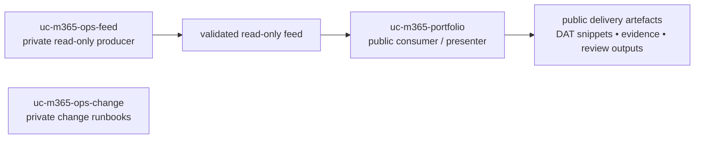
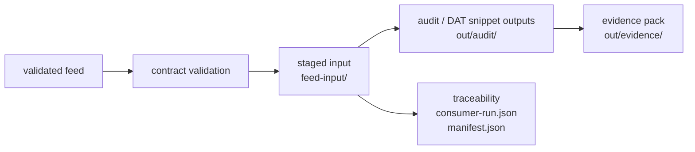

# UC & Microsoft 365 Portfolio — Teams Voice Delivery

[](https://github.com/253718/uc-m365-portfolio/actions/workflows/ci.yml)

Public, read-only portfolio showing how I structure Microsoft Teams Voice delivery outputs for critical and regulated environments, with a focus on review quality, traceability, auditability, and handover-supporting artefacts.

The current primary path is feed-driven and focuses on Teams Phone / Direct Routing review outputs, DAT snippets, and evidence packs generated from a validated read-only feed.

Supporting docs, templates, and case studies illustrate the broader delivery approach around review, traceability, and handover, without claiming to be a full architecture dossier.

## Reviewer path

If you have 5 minutes:

- Start with `docs/case-studies/france-monaco-dual-operator.md`
- Then review `docs/output-contract.md`
- Then open the generated outputs listed in the Quick start section
- For architecture context, see `docs/portfolio.md`

## What this repository demonstrates

- Teams Voice / Direct Routing delivery thinking beyond simple administration
- Feed-driven, read-only production of review and evidence artefacts
- Traceability through staged input, manifests, and packaged outputs
- Delivery discipline for environments where documentation quality, traceability, and handover-supporting outputs matter

## Repository roles



- `uc-m365-ops-feed` produces the validated read-only feed.
- `uc-m365-portfolio` consumes the feed and generates public-facing outputs.
- `uc-m365-ops-change` contains private tenant-changing runbooks.

## Delivery pipeline



The portfolio-side pipeline keeps the same internal shape throughout the repository: consume input, generate review artefacts, and package evidence. The feed-driven model changes the upstream boundary by making the public repository consume a validated read-only feed instead of collecting tenant data directly.

## Quick start

### 1. Validate the bundled feed fixture

```powershell
./tooling/Validate-FeedContract.ps1 -FeedPath ./tests/Fixtures/feed-sample
```

### 2. Generate audit / DAT snippet outputs

```powershell
./src/TeamsPhone/Exports/Invoke-TeamsPhoneDatExport.ps1 -FeedPath ./tests/Fixtures/feed-sample -RunId demo001
```

### 3. Generate the evidence pack

```powershell
./src/Compliance/EvidencePacks/Invoke-TeamsPhoneEvidencePack.ps1 -FeedPath ./tests/Fixtures/feed-sample -RunId demo001
```

### 4. Open the generated artefacts

Start with:

- `./out/audit/teamsphone-demo001/DAT-snippets.md`
- `./out/evidence/teamsphone-evidence-demo001/SUMMARY.md`
- `./out/evidence/teamsphone-evidence-demo001.zip`

### 5. Repository checks

```powershell
./tooling/Validate-FeedContract.ps1 -FeedPath ./tests/Fixtures/feed-sample
./tooling/Verify-ReadOnly.ps1 -Root . -FailOnMatch
./tooling/Invoke-RepoTests.ps1
```

The repository CI enforces script analysis, Markdown linting, the read-only guardrail, feed validation, and repository tests.

- The bundled fixture under `tests/Fixtures/feed-sample/` is the official demonstration input.
