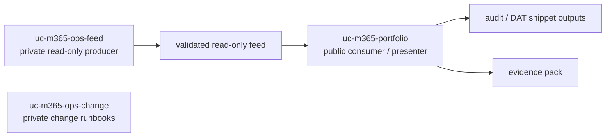
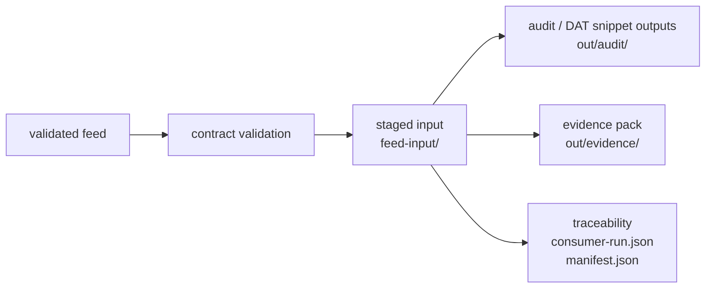

# Architecture

The public repository consumes a validated read-only feed and generates technical review artefacts, evidence packs, and DAT snippets rather than a full architecture dossier.

## Repository roles

## Delivery pipeline

## Output shape

- `./out/audit/` contains run outputs and DAT snippet artefacts.
- `./out/evidence/` contains packaged evidence artefacts.
- `feed-input/` preserves the consumed input for traceability.
